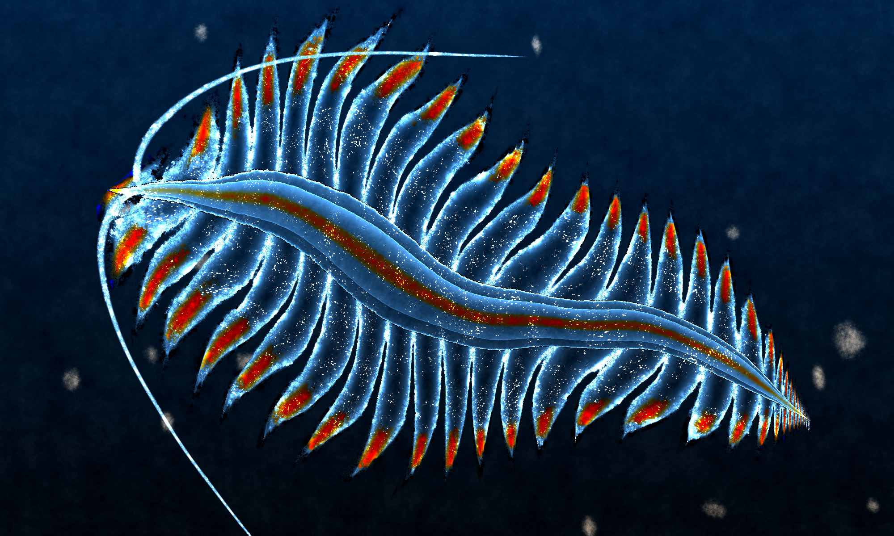
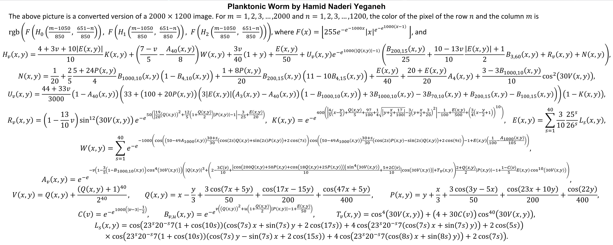

  

 

# Art with Mathematical Equations

## Description
This project constructs an artistic illustration, depicting a planktonic worm, using only mathematical formulas.
For each of the 1200x2000 pixels in the [image](img.png), there are 3 main functions that dictate the RGB values of each pixel. 
In turn, these main functions are entirely defined by an intricate composition of simpler functions, like exponentials, 
sines and cosines. These functions, formulated by Hamid Naderi and originally posted on his [X account](https://x.com/naderi_yeganeh), 
are the following:

  

## Code Optimization
A naive approach to coding the equations may lead to a long computation time. First, many of the equations repeatedly call the same 
nested functions with the same arguments. We can take advantage of this by equiping each nested function with an LRU cache. 
Second, we can speed up the program with parallelization, since the RGB values of a given pixel can be calculated independently from the others. 
With 16 CPU cores, a Python implementation constructed the image in 14 minutes.
